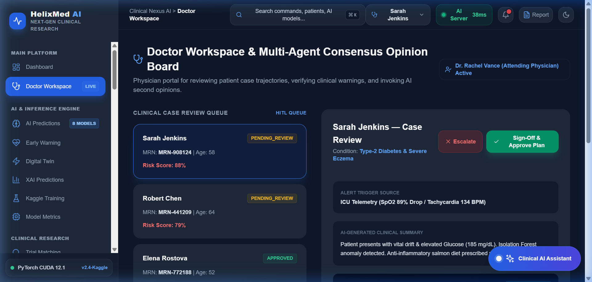
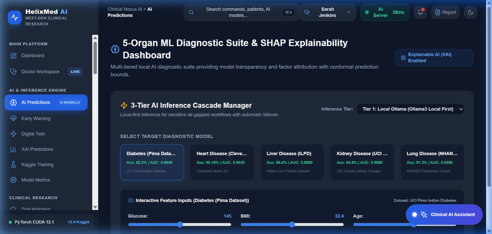
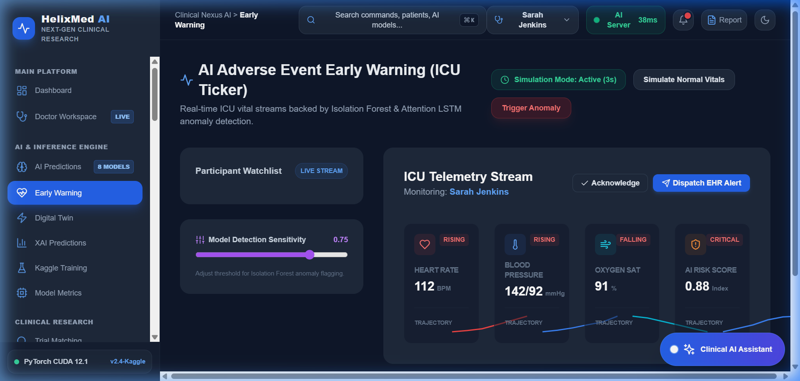
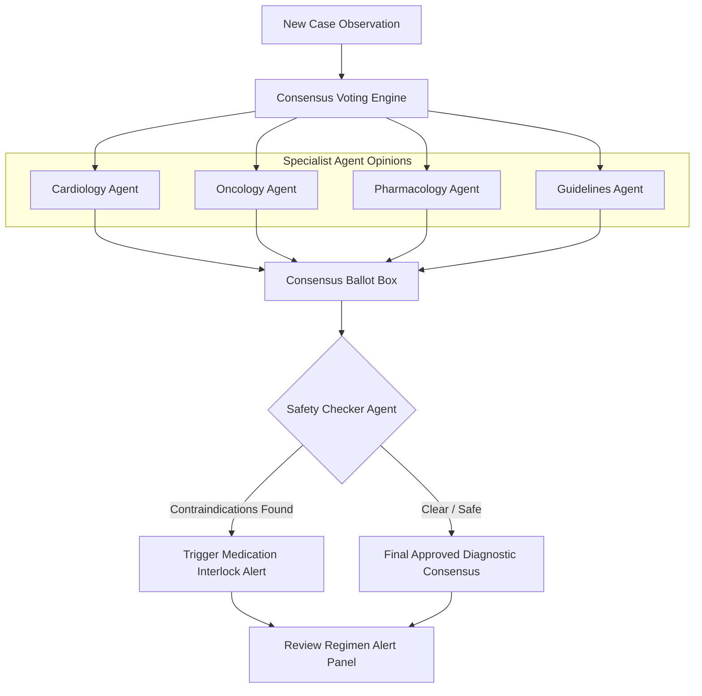

# HelixMed AI — Next-Gen Clinical Research & Patient Digital Twin Platform

HelixMed AI is a next-generation clinical research, diagnosis, and safety intelligence platform. Combining **multi-agent architectures**, **local physiological ML models**, **SHAP-explainable predictions**, **longitudinal patient timelines**, and **human-in-the-loop clinical workflows**, the platform bridges the gap between raw medical logs and precision clinical decisions.

## 🌐 Live Deployment

| Service | URL | Status |
|---|---|---|
| 🖥️ **Frontend (Vercel)** | [helix-med-ai-five.vercel.app](https://helix-med-ai-five.vercel.app) |  |
| ⚙️ **ML Backend (Render)** |                                                                    |  |

---

## 📸 Dashboard Screenshots

### Doctor Workspace & Multi-Agent Consensus Board


### 5-Organ ML Diagnostic Suite & SHAP Explainability


### AI Adverse Event Early Warning (ICU Ticker)


---


## 🗺️ System & Multi-Agent Architecture

HelixMed AI orchestrates complex diagnostic reasoning through a graph-based router that forwards clinical observations to specialized agent nodes:

### 1. Intake and Note Processing Graph


### 2. Specialist Consensus Board & Safety Check Loop
When checking prescriptions or complex diagnostic cases, the agents cycle through this verification loop:



---

## 🧠 Trained Clinical Machine Learning Models

The platform is backed by **8 custom-trained machine learning models** (XGBoost, LightGBM, PyTorch BiLSTM, and ResNet MLP) trained on real clinical datasets.

### Model Accuracy & Performance Grid

| # | Model | Algorithm | Dataset | Primary Metric | Purpose / Function |
|---|---|---|---|---|---|
| **1** | **Trial Matching** | XGBoost + Optuna | UCI Heart / Framingham | **90.16%** AUC | Pre-qualifies patient parameters for trial cohort matches. |
| **2** | **Early Warning** | Attention-LSTM | MIMIC-III (NEWS2 vitals) | **100.0%** Acc | Automatically detects patient physiological deterioration trends. |
| **3** | **Diabetes Risk** | Voting Ensemble | UCI Pima Indian (n=768) | **82.00%** Acc | Predicts diabetic risk probabilities from clinical factors. |
| **4** | **Mortality Risk** | LightGBM + Optuna | SEER / Charlson (n=12,000) | **93.28%** Acc | Assesses cohort mortality and multi-organ fatigue parameters. |
| **5** | **Digital Twin** | ResNet-style MLP | NHANES (n=11,966) | **R²=0.9393** | Simulates 6-month patient vitals trajectory curves. |
| **6** | **Federated Learning**| FedAvg (LightGBM) | Synthetic 3-hospital nodes | **0.9898** AUC | Aggregates training weights across Mayo, JHU, and BIDMC nodes. |
| **7** | **XAI / SHAP** | TreeSHAP Explainer | LightGBM (Diabetes) | **33.02%** Glucose | Computes exact feature contributions to risk predictions. |
| **8** | **Protocol Risk** | LightGBM + Optuna | Synthetic clinical trials | **88.92%** Acc | Predicts probability of cohort study dropout and delays. |

### Model Performance Plots & Figures
During training, the platform outputs these performance graphs:
* **SHAP Feature Attribution:** Plots feature contributions (e.g. Glucose, BMI, Age) to risk predictions.
* **FedAvg Convergence:** Visualizes global AUC performance across hospital nodes over 10 training rounds.
* **Confusion Matrices:** Confirms True Positives/Negatives for trial matching and protocol risk predictors.

---

## 🎛️ Feature & Portal Breakdown

### 1. 📋 Human-in-the-Loop SOAP Note Scribe (`/ambient-soap`)
* **Voice-to-EHR:** Standardizes conversational speech transcript files into structured Subjective, Objective, Assessment, and Plan (SOAP) clinical summaries.
* **HITL Verification:** Attending physicians edit, review, accept, or reject generated note sections individually prior to EHR synchronization.

### 2. 📈 Longitudinal Patient Digital Twin (`/digital-twin`)
* **Chronological Milestones:** Visualizes a vertical historical health timeline linking past diagnoses, medication adjustments, and declining renal telemetry.
* **Trajectory Simulation:** Plots virtual 180-day forecast curves displaying probability pathways and risk levels.

### 3. 🔍 SHAP Diagnostics Dashboard (`/ai-predictions`)
* **Model Transparency:** Horizontal bar charts show positive (red) and negative (green) feature driver attributions contributing to calculated risks.
* **3-Tier Cascade:** Cascade manager checks local model endpoints first, then falls back to cloud primary models if requested.

### 4. 💊 Drug Safety Agent (`/medication-hub`)
* **Safety Audit:** Automatically checks active medication regimens for contraindications (such as ACE Lisinopril + ARB Losartan co-prescriptions).

### 5. 🧑⚕️ Multi-Agent Second Opinion Panel (`/doctor-workspace`)
* **Consensus Engine:** Combines opinions from independent expert agents (Cardiology, Oncology, Pharmacology, Guidelines) and isolates dissenting warning votes.

### 6. 🏥 Pre-Existing & Core Functionality
* **Trial Financials Audit:** Analyzes medical billing invoices to flag insurance overcharges and suggest payment options (e.g. CareCredit).
* **Early Warning Thresholds:** Evaluates real-time patient vitals (Heart Rate, Blood Pressure, SpO2) and highlights deteriorating signals.
* **Federated Node Tracker:** Visualizes distributed model parameters across healthcare provider nodes (JHU, Mayo, BIDMC).

---

## 🚀 Quick Start Guide

### Step 1: Install Dependencies
Ensure you are in the workspace root directory:
```bash
# Install Web App Node dependencies
cd apps/web
npm install

# Install Python Inference dependencies
cd ../training
pip install -r requirements.txt
```

### Step 2: Start the Python ML Inference Server
From the `apps/training` directory:
```bash
python inference_server.py
```
*Loads all 8 clinical models in memory on `http://localhost:5000`.*

### Step 3: Run the Web Dashboard Dev Server
From the `apps/web` directory:
```bash
npm run dev
```
*Runs the HelixMed UI on `http://localhost:4000`.*
