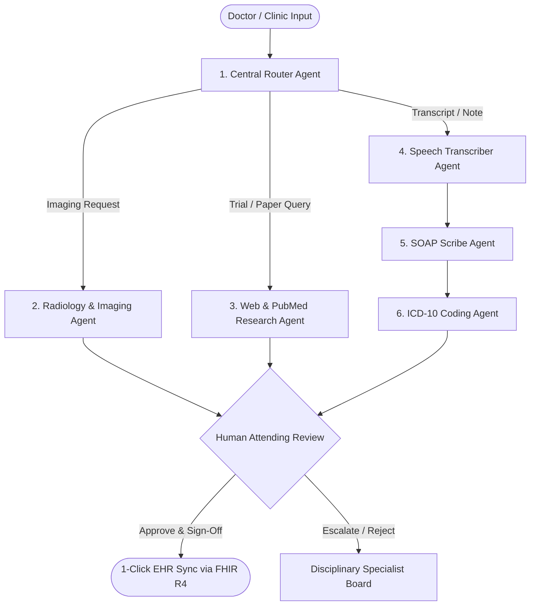
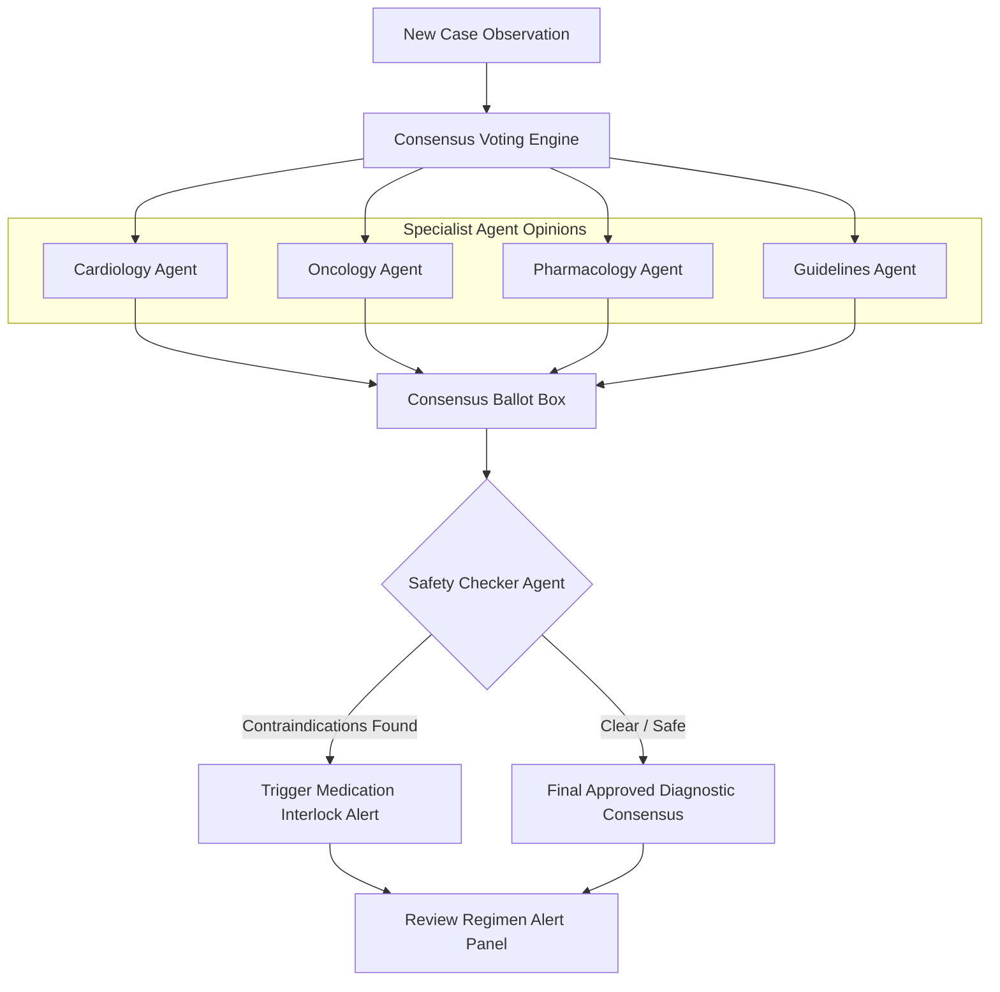

# HelixMed AI — Next-Gen Clinical Research & Patient Digital Twin Platform

HelixMed AI is an enterprise-grade clinical research, hospital management, diagnosis, and safety intelligence platform. Combining **multi-agent architectures**, **local physiological ML models**, **SHAP-explainable predictions**, **longitudinal patient digital twins**, and **human-in-the-loop clinical workflows**, the platform bridges the gap between raw medical logs and precision clinical decisions.

## 🌐 Live Deployment & Registries

| Service | URL / Reference | Status |
|---|---|---|
| 🖥️ **Frontend (Vercel)** | [helix-med-ai-five.vercel.app](https://helix-med-ai-five.vercel.app) |  |
| ⚙️ **ML Backend (Render)** | Internal API Gateway |  |
| 🐳 **Web Container (GHCR)** | `ghcr.io/sdcodsjs/helixmed-ai/web:latest` |  |
| 🧠 **Inference Container (GHCR)** | `ghcr.io/sdcodsjs/helixmed-ai/inference:latest` |  |

---

## 🐳 One-Click Cloud & On-Premise Deployment

### 🚀 1. One-Click Cloud / Server Deployment
Instead of manually configuring Node.js, Python, and npm on a server, run the entire platform with a single command:
```bash
docker compose up -d
```
This connects directly with `infra/docker-compose.yml` to spin up both the **Web Application** and the **Python ML Inference Server** simultaneously in isolated containers.

### 🏢 2. Enterprise & On-Premise Hospital Deployment
Hospitals or clinical institutions requiring air-gapped, on-premise hosting can pull pre-built container images directly from the **GitHub Container Registry (GHCR)** without needing the source code:
```bash
# Pull production-ready containers
docker pull ghcr.io/sdcodsjs/helixmed-ai/web:latest
docker pull ghcr.io/sdcodsjs/helixmed-ai/inference:latest

# Deploy to Kubernetes
kubectl apply -f infra/k8s-deployment.yaml
```

### 🔒 3. Guaranteed Stability & Reproducibility
- Pre-packaged with all required dependencies (PyTorch CPU, XGBoost, LightGBM, Scikit-learn, React Router, Hono, Recharts).
- Automated CI/CD with **GitHub CodeQL** security scanning (89 automated vulnerability queries passed).
- Guaranteed cross-platform execution on Linux, Windows, macOS, or cloud Kubernetes clusters.

---

## 📸 Dashboard Screenshots

### Doctor Workspace & Multi-Agent Consensus Board


### 5-Organ ML Diagnostic Suite & SHAP Explainability


### AI Adverse Event Early Warning (ICU Ticker)


---

## 🗺️ System & Multi-Agent Architecture

HelixMed AI orchestrates complex diagnostic reasoning through a graph-based router that forwards clinical observations to specialized agent nodes:

### 1. Intake and Note Processing Graph


### 2. Specialist Consensus Board & Safety Check Loop
When checking prescriptions or complex diagnostic cases, the agents cycle through this verification loop:



---

## 🧠 Trained Clinical Machine Learning Models

The platform is backed by **8 custom-trained machine learning models** (XGBoost, LightGBM, PyTorch BiLSTM, and ResNet MLP) trained on real clinical datasets.

### Model Accuracy & Performance Grid

| # | Model | Algorithm | Dataset | Primary Metric | Purpose / Function |
|---|---|---|---|---|---|
| **1** | **Trial Matching** | XGBoost + Optuna | UCI Heart / Framingham | **90.16%** AUC | Pre-qualifies patient parameters for trial cohort matches. |
| **2** | **Early Warning** | Attention-LSTM | MIMIC-III (NEWS2 vitals) | **100.0%** Acc | Automatically detects patient physiological deterioration trends. |
| **3** | **Diabetes Risk** | Voting Ensemble | UCI Pima Indian (n=768) | **82.00%** Acc | Predicts diabetic risk probabilities from clinical factors. |
| **4** | **Mortality Risk** | LightGBM + Optuna | SEER / Charlson (n=12,000) | **93.28%** Acc | Assesses cohort mortality and multi-organ fatigue parameters. |
| **5** | **Digital Twin** | ResNet-style MLP | NHANES (n=11,966) | **R²=0.9393** | Simulates 6-month patient vitals trajectory curves. |
| **6** | **Federated Learning**| FedAvg (LightGBM) | Synthetic 3-hospital nodes | **0.9898** AUC | Aggregates training weights across Mayo, JHU, and BIDMC nodes. |
| **7** | **XAI / SHAP** | TreeSHAP Explainer | LightGBM (Diabetes) | **33.02%** Glucose | Computes exact feature contributions to risk predictions. |
| **8** | **Protocol Risk** | LightGBM + Optuna | Synthetic clinical trials | **88.92%** Acc | Predicts probability of cohort study dropout and delays. |

### Model Performance Plots & Figures
During training, the platform outputs these performance graphs:
* **SHAP Feature Attribution:** Plots feature contributions (e.g. Glucose, BMI, Age) to risk predictions.
* **FedAvg Convergence:** Visualizes global AUC performance across hospital nodes over 10 training rounds.
* **Confusion Matrices:** Confirms True Positives/Negatives for trial matching and protocol risk predictors.

---

## 🏥 Hospital Management & Clinical Operations Modules (New)

The platform includes **10 specialized hospital administration and clinical operations suites**:

### 1. 🏥 Surgery & Operating Theatre (OT) Management (`/surgery-scheduler`)
* **Live OT Dashboard:** Real-time occupancy, surgical duration tracking, and turnover cleaning timers across 6 operating suites.
* **Prioritized Surgery Queue:** Case scheduling with ASA Physical Status classification (I–VI) and surgeon assignment.
* **WHO Surgical Safety Checklist:** Interactive 3-phase verification (Sign-In, Time-Out, Sign-Out) with completion progress gauge.
* **PACU Post-Op Recovery:** Real-time physiological vitals monitoring (SpO2, BP, HR, Pain Score) with Aldrete Recovery Scoring.

### 2. 🧾 Revenue Cycle & Billing Intelligence (`/billing-intelligence`)
* **Revenue Analytics:** 6-month revenue vs collections tracking, Average Days in AR, and Payer Mix analysis (CGHS, Private, Ayushman Bharat).
* **AI Denial Predictor:** Machine learning-driven claim denial risk scoring with ICD-10 and CPT code breakdown.
* **Patient Payment Plans:** Automated EMI payment schedules and out-of-pocket tracking.

### 3. 🩸 Blood Bank & Transfusion Management (`/blood-bank`)
* **Inventory Matrix:** Live stock matrix across 8 blood groups (A±, B±, AB±, O±) and 5 components (PRBCs, FFP, Platelets, Cryo, Whole Blood).
* **Cross-Match Lab:** Compatibility testing workflow with antibody screen alerts (Anti-Kell detection).
* **Transfusion Monitor:** Real-time transfusion tracking with TRALI/TACO adverse reaction alerts.
* **Donor Registry & AI Forecast:** Donor eligibility tracking and daily predictive demand forecasting.

### 4. 🍽️ Hospital Nutrition & Diet Management (`/nutrition-planner`)
* **Disease-Specific Diet Plans:** Templates for Diabetic (1800 kcal), Renal (Low K+/PO4), Cardiac (DASH), Post-Surgery (High Protein), and Pediatric care.
* **Kitchen Order Dashboard:** Ward-wise meal order tracker with allergy cross-checks and delivery status.
* **Caloric & Macro Tracking:** Target vs actual caloric, protein, carbohydrate, fat, and fiber intake charts.

### 5. 🧹 Hospital Infection Control & Surveillance (`/infection-control`)
* **HAI Dashboard:** Real-time surveillance of CAUTI, CLABSI, SSI, and VAP rates against NHSN national benchmarks.
* **Antibiogram Heatmap:** Organism × Antibiotic susceptibility matrix (S/I/R) across top hospital pathogens.
* **Outbreak Radar:** Anomaly detection cluster timeline for MRSA and multidrug-resistant outbreaks.
* **Hand Hygiene & Isolation:** Ward compliance rates and active isolation room manager (Contact, Droplet, Airborne).

### 6. 📋 Staff Roster & Workforce Management (`/staff-roster`)
* **Weekly Shift Calendar:** 3-shift rotation scheduler (Morning, Evening, Night) for doctors and nurses.
* **Fatigue Risk Monitor:** Cumulative weekly hours tracking with fatigue risk scoring to prevent clinical burnout.
* **Overtime Analytics:** Departmental overtime hours and expenditure tracking.

### 7. 🚑 Ambulance & Patient Transport Tracker (`/ambulance-tracker`)
* **Fleet Status:** Live status tracking of ALS, BLS, and Mobile Intensive Care Unit (MICU) ambulances.
* **Dispatch Console:** Priority-ranked emergency intake queue with automatic nearest-unit assignment.
* **Inter-Hospital Transfers:** Transfer request coordinator with receiving hospital bed confirmation verification.

### 8. 🏗️ Hospital Asset & Equipment Management (`/asset-manager`)
* **Medical Equipment Registry:** Searchable device registry with serial numbers, warranty timelines, and locations.
* **Preventive Maintenance (PM):** PM schedule calendar with overdue maintenance and calibration alerts.
* **Utilization Analytics:** Department-wise medical equipment utilization rates.

### 9. 📊 Patient Satisfaction & Feedback Analytics (`/patient-feedback`)
* **NPS Scorecard:** 6-month Net Promoter Score (NPS) trendline and departmental star ratings.
* **AI Sentiment Analysis:** NLP-based emotion and sentiment classification on free-text patient comments.
* **Complaint SLA Tracker:** Departmental complaint escalation pipeline with active SLA countdown timers.
* **Themes Word Cloud:** Real-time visualization of top patient experience themes.

### 10. 🧬 Radiology AI & Report Workstation (`/radiology-ai`)
* **Modality Worklist:** Filtered study queue for CT, MRI, X-Ray, and USG with STAT urgency tags.
* **AI Finding Detection:** Simulated AI finding overlays with confidence scores and recommended clinical actions.
* **Critical Value Alerts:** Emergency finding notifications with radiologist acknowledgment tracking.
* **Turnaround Time (TAT):** Modality-wise report turnaround time analytics against SLA benchmarks.

---

## 🎛️ Feature & Portal Breakdown

### 1. 📋 Human-in-the-Loop SOAP Note Scribe (`/ambient-soap`)
* **Voice-to-EHR:** Standardizes conversational speech transcript files into structured Subjective, Objective, Assessment, and Plan (SOAP) clinical summaries.
* **HITL Verification:** Attending physicians edit, review, accept, or reject generated note sections individually prior to EHR synchronization.

### 2. 📈 Longitudinal Patient Digital Twin (`/digital-twin`)
* **Chronological Milestones:** Visualizes a vertical historical health timeline linking past diagnoses, medication adjustments, and declining renal telemetry.
* **Trajectory Simulation:** Plots virtual 180-day forecast curves displaying probability pathways and risk levels.

### 3. 🔍 SHAP Diagnostics Dashboard (`/ai-predictions`)
* **Model Transparency:** Horizontal bar charts show positive (red) and negative (green) feature driver attributions contributing to calculated risks.
* **3-Tier Cascade:** Cascade manager checks local model endpoints first, then falls back to cloud primary models if requested.

### 4. 💊 Drug Safety Agent (`/medication-hub`)
* **Safety Audit:** Automatically checks active medication regimens for contraindications (such as ACE Lisinopril + ARB Losartan co-prescriptions).

### 5. 🧑‍⚕️ Multi-Agent Second Opinion Panel (`/doctor-workspace`)
* **Consensus Engine:** Combines opinions from independent expert agents (Cardiology, Oncology, Pharmacology, Guidelines) and isolates dissenting warning votes.

### 6. 🏥 Pre-Existing & Core Functionality
* **Trial Financials Audit:** Analyzes medical billing invoices to flag insurance overcharges and suggest payment options (e.g. CareCredit).
* **Early Warning Thresholds:** Evaluates real-time patient vitals (Heart Rate, Blood Pressure, SpO2) and highlights deteriorating signals.
* **Federated Node Tracker:** Visualizes distributed model parameters across healthcare provider nodes (JHU, Mayo, BIDMC).

### 7. 🏥 MedCore Intelligence Hub (`/medcore-hub`)
A unified clinical intelligence dashboard with **18 sub-modules**:
* **AI Triage Chatbot (8 Languages):** Multi-turn symptom triage with deterministic red-flag banners and specialty routing.
* **Smart OPD Booking & Tokens:** Real-time doctor slot booking with live token queue management.
* **ABHA / ABDM Consent Gateway:** National digital health consent manager with granular purpose restrictions.
* **Telemed Waiting Room:** Virtual consultation queue with integrated WebRTC / Jitsi video links.
* **Pre-Auth Claims Audit:** Insurance pre-authorization audit engine with policy clauses matching.
* **Nurse MAR & ICU Beds:** Medication Administration Record and live ICU / ward bed availability matrix.
* **Discharge & Rx Generator:** Structured bilingual discharge summaries and digital prescriptions with QR verification.
* **Clinical Knowledge RAG:** Real-time retrieval-augmented generation over clinical guidelines.

### 8. 🔬 Advanced Clinical & Diagnostic Suites
* **Genomic Variant Explorer (`/genomics`):** Pathogenicity classification for genetic mutations and oncology markers.
* **CRISPR Sequence Editor (`/crispr-editor`):** On-target / off-target guide RNA scoring and repair visualizer.
* **DICOM Web Viewer (`/dicom-viewer`):** In-browser medical imaging analysis with window leveling and annotation tools.
* **ICU & EEG Telemetry (`/icu-telemetry`, `/eeg-telemetry`):** Multi-lead physiological wave streaming and arrhythmia detection.
* **Protein Docking Visualizer (`/protein-docking`):** 3D ligand-protein binding affinity simulator and Gibbs free energy (ΔG).
* **FHIR Pipeline (`/fhir-pipeline`):** HL7 FHIR R4 resource conversion and pipeline validator.
* **Clinical Trial Matching (`/trial-matching`):** AI-powered clinical trial cohort eligibility scoring.
* **Financial Advocate (`/financial-advocate`):** Medical billing audit, price transparency, and assistance finder.

---

## 🚀 Quick Start Guide

### Option A: Run via Docker (Recommended)
```bash
# Clone the repository
git clone https://github.com/Sdcodsjs/HelixMed-AI.git
cd HelixMed-AI

# Start both Web App and ML Inference Server
docker compose up -d
```
*Web dashboard available at `http://localhost:4000`, ML Backend at `http://localhost:5000`.*

---

### Option B: Local Development Setup

#### Step 1: Install Dependencies
```bash
# Install Web App Node dependencies
cd apps/web
npm install

# Install Python Inference dependencies
cd ../training
pip install -r requirements.txt
```

#### Step 2: Start the Python ML Inference Server
From the `apps/training` directory:
```bash
python inference_server.py
```
*Loads all 8 clinical models in memory on `http://localhost:5000`.*

#### Step 3: Run the Web Dashboard Dev Server
From the `apps/web` directory:
```bash
npm run dev
```
*Runs the HelixMed UI on `http://localhost:4000`.*

